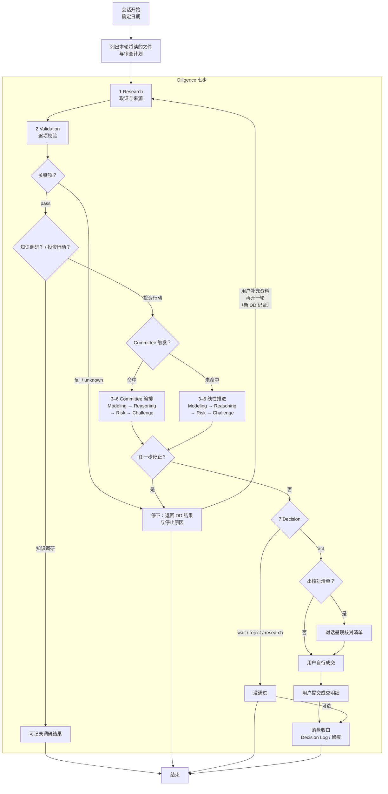

# PIOS 架构说明

本文件是设计说明，供人阅读，系统运行时不由任何路线加载。可执行规则正文只在 `orchestration/`、`skills/`、`vendor/`、`workflow/` 与 `database/`；本文件里出现的规则是复述，权威位置在上列目录。

PIOS（Personal Investment Operating System）用文件管理金融知识、产品与组合数据，以及每笔投资判断的留痕，辅助用户做投资动作审查或知识探索与市场调研。

系统分三层，依次是场景、编排、能力单元。

用户每一次使用系统——买 ETF、卖 ETF、做例行定投、再平衡、组合复核、构造 IPS，或改仓库规则、查一个概念——都先落到 `workflow/` 下的某张场景卡片。三条路线各有自己的卡片，Agent 按卡片给出的参数编排后续对话与工作。场景卡片只声明适用范围、前置输入、深度分档和 Committee 触发，不写步骤。

编排规定每一步调用哪个能力单元、按什么顺序调用、在什么条件下停下。默认编排是 Due Diligence，后面简称 DD，意为尽职调查，五个已启用场景都用它。五个场景共用同一套七步和门禁，差别只在每步的参数：买入场景要先核代码、折溢价与申赎状态，复核场景要先核统一时点市值与偏离，例行定投在符合条件时可以走轻量路径。完整对照见 4.2。

编排不只服务投资。用户按自己的使用习惯改规则、改架构、改加载协议、补缺口时，走的是系统建设编排：定范围、找权威位置、改权威位置、回填引用、一致性检查、记变更。它不产出四结论。五个编排的对照见 1.2。

能力单元是 `skills/` 下的 SKILL.md，一份管一件事怎么做。Research 管取证，Validation 管核验，Decision 管出结论。

三层的关系：场景决定这次要办什么，编排决定按什么顺序办，能力单元决定每一步怎么办。这样安排，不同场景该查的东西可以不同，判断标准却不会跟着场景变。

核心承诺：每条投资判断事后可追溯。当时看见什么、为何这样选、何时该失效，都有文件可查。

Agent 可直接读写仓库文件，每次写入后在对话中明确告知改了什么。用户自己用编辑器读写不受此限。约定可被故意违反或绕过，但同时也会失去本项目的意义。

## 一、架构分层

三层架构的关系见文首。本章写每层的规则：场景卡片能声明什么、编排由哪些要素构成、能力单元如何分类，以及跨编排共享哪些不变量。

### 1.1 场景

用户说「我要定投」，不说「我要走 DD」——场景对用户可见，编排对用户透明。

场景卡片不写步骤，步骤由编排决定。场景卡片也不自设门禁——门禁跨场景共用，各场景自己编一套就会碎片化；结论落地后的收口动作（记录授权、回写持仓）按场景展开。完整表述见 4.2。

### 1.2 编排

编排 = 适用场景 + 步骤序列 + 每步加载哪份正文 + 停止条件 + 产物。

DD 是默认编排：Research → Validation → Modeling → Reasoning → Risk → Challenge → Decision。五个已启用场景共用它。

编排正文统一放在 `orchestration/<编排>/SKILL.md`。一个编排要独立成文件，得同时具备三样：自己的步骤序列、自己的停止条件、自己的产物。缺任何一样，就只是加载分档，写进 [AGENTS.md](AGENTS.md) 的路线判断里，不另立编排。`[learning]` 原先只有加载分档，没有自己的停止条件与产物，2026-09-11 补齐后才立为 `orchestration/learning/`。

四层的通用判据：**每一层回答一个每轮都必须回答的问题，答案放在哪由复用决定**——只一处用就写在调用方内部，两处以上用才抽成独立文件。路线回答「本轮读哪份」；场景回答「这次的具体参数与前置输入」；编排回答「顺序、何时停、产出什么」；能力单元回答「这件事怎么做」。抽成文件的触发条件是第二个使用者出现。

目前系统里有五个编排：

| 编排 | 正文位置 | 面对的场景 |
|---|---|---|
| DD | [orchestration/diligence/SKILL.md](orchestration/diligence/SKILL.md) | ETF 买入、ETF 卖出、例行定投、再平衡、组合复核、产品排序 |
| Committee | [orchestration/committee/SKILL.md](orchestration/committee/SKILL.md) | 内嵌在 DD 第 3–6 步，不单独面对场景 |
| IPS 构造 | [orchestration/ips_setup/SKILL.md](orchestration/ips_setup/SKILL.md) | IPS 首次构造 |
| 知识调研 | [orchestration/learning/SKILL.md](orchestration/learning/SKILL.md) | 轻量查询、标准取证两档 |
| 系统建设 | [orchestration/building/SKILL.md](orchestration/building/SKILL.md) | 三档：`read-only` 只读说明、`local` 单条改动、`cross-layer` 跨层改动 |

DD、IPS 构造、知识调研、系统建设各自独立面对场景。Committee 是局部编排：作用域只有 DD 的第 3–6 步，它换掉的是执行方式，把依次单线推进换成四席先独立审查再合议；步骤顺序不变，每步加载的正文也不变。

DD、IPS 构造与 Committee 服务投资判断；系统建设不产出投资结论，按 1.4 不受 Decision 门禁约束。

编排不是自由组合，能力单元之间存在依赖方向：Modeling 只能用 Validation 放行后的数据，Decision 必须排在最后。新编排只能从这些能力单元里挑子集、排顺序，不能改动依赖方向。

三条路线的判断条件、加载分档与边界集中在 [AGENTS.md](AGENTS.md) 的「先判断目的」一节，那是每轮开场唯一必读的正文。编排正文只在被该路线选中时才读，不占开场成本。

### 1.3 能力单元

`skills/` 下有 9 个目录，都是能力单元。research、validation、modeling、reasoning、risk、challenge、decision 各管七步里的一步。

另两个跨步复用：[evidence](skills/evidence/SKILL.md) 被 research 与 validation 两步共用，[docs](skills/docs/SKILL.md) 在写人读文档时加载。它们不占七步里的任何一步，所以不进编排正文，也不必被每轮会话开场加载。

编排放 `orchestration/`，第三方工具放 `vendor/`，两者都不是能力单元。

能力单元只回答「这件事怎么做」，不回答「什么时候做」。什么时候做由编排决定。

### 1.4 不变量

编排可以多样，门禁不能多样。凡是要写 `act` / `wait` / `reject` / `research` 的编排，共享同一套约束：

- 四结论枚举，不得自造第五种
- Decision 五条硬门禁
- `act` 绑定价格区间，超区间自动失效
- Decision Log 冻结，事后只能追加
- 证据标准与数据时效

不出四结论的编排不受这套门禁约束。IPS 构造产出政策文件，靠用户批准，不靠 Agent 裁决。它仍然要核验内容，核验的是内容可复核，不是市场数据时效。

## 二、一次完整运转

这一章用一条链路讲清系统怎么转。细节在后面各章。

### 2.1 会话怎么开始：先判断目的，再走路线

每轮会话开始，Agent 按 [AGENTS.md](AGENTS.md)「先判断目的」判定本轮属于三条路线中的哪一条，然后只读该路线指定的正文。用户不需要手动选择路线：用户带着场景来，Agent 判断后开场标注，用户看到标注不对可以直接纠正。

标定为 `[invest]` 时，Agent 再按场景读 `workflow/` 下的卡片，确认本轮的前置输入。

### 2.2 三条路线

| 路线 | 干什么 | 走的编排 | 边界 |
|---|---|---|---|
| `[building]` | 系统建设：改规则、架构、加载协议、目录结构、数据契约 | 系统建设五步，见 `orchestration/building/SKILL.md`；场景见 `workflow/building.md` | 不给投资结论；不写四结论 |
| `[learning]` | 知识调研：弄清概念或产品事实 | 轻量查询与标准取证两档，见 `orchestration/learning/SKILL.md`；场景见 `workflow/learning.md` | 禁止写 `act` / `wait` / `reject` / `research`；发现产品不等于推荐产品 |
| `[invest]` | 投资事务：对具体标的形成买入、卖出、持有、定投、调仓或产品排序结论，或首次构造 IPS，或数据初始化与维护 | 出结论走 DD 七步，命中触发时第 3–6 步改由 Committee 编排；构造 IPS 走 `orchestration/ips_setup/SKILL.md`；种子核验与来源登记走 `workflow/seed_ingest.md`、`workflow/register.md` | 唯一能写四结论的路线；写四结论必须走七步；其余三类不写四结论 |

两条边界规则：同时命中 `[building]` 与另一条时，Agent 先问用户本轮做哪件；`[learning]` 与 `[invest]` 之间以用户是否确认要对具体标的形成结论为准，用户没确认就按 `[learning]` 处理。轻量查询中用户突然要买，Agent 须先确认升格为 `[invest]`，再往下推进。

### 2.3 一条投资动作从头到尾

以「买一只场内 ETF」为例。背景是场外 QDII 联接限购，用户想找可替代的场内产品。

1. **开场**：用户说清目标。Agent 判断目的为 `[invest]`，列出本轮将读的文件与审查计划。
2. **场景入口**：Agent 按场景读对应的 workflow 卡片，本例读 [workflow/buy_etf.md](workflow/buy_etf.md)，确认前置输入齐备：IPS 为 `active`、目标配置有效、候选产品、同一时点数据。
3. **七步审查**：Research 取数 → Validation 核验 → Modeling 比较 → Reasoning 推理 → Risk 分级 → Challenge 唱反调 → Decision 出结论。首次买入触发 Committee 编排第 3–6 步。
4. **结论**：Decision 只有四种：`act` / `wait` / `reject` / `research`。`act` 绑定价格区间和失效条件。
5. **落盘收口**：Agent 建立 Decision Log 并冻结，写入 `frozen_at` 和内容哈希，事后只能追加不能改写。
6. **执行**：Agent 呈现执行前核对清单，不得下单。用户在券商自行成交。
7. **记账**：用户告知成交明细，Agent 更新持仓快照并追加 Decision Log。
8. **复盘**：到复核日或触发器命中时，Agent 重新进入七步审查。

总图：



中途任何一步停下时，例如数据缺失、来源冲突、风险 `Critical`、Challenge 否决，Agent 只返回 DD 结果与停止原因，不写正式结论。[reports/demo/](reports/demo/) 与 [decision_log/demo/](decision_log/demo/) 里有两份演示工件，证明系统在关键输入缺失时正确停在 `research`，而不是硬给建议。它们不代表审查已通过。

### 2.4 三条铁律

1. **Agent 不接券商、不代下单**。`act` 只是「建议满足执行条件」，不是交易授权。交易只能在用户自己的券商客户端完成。
2. **Agent 写文件、用户 git diff 审核**。Agent 可直接读写仓库文件并每次告知改了什么；推荐用 git 管理，用户通过 `git diff` 审核每次变更。
3. **数据时效人工核对**。动态数据带适用时点 `valid_at`，超期就记 `unknown`，并阻断 `act`。仓库没有自动行情，Agent 不能假设旧数据仍然有效。

## 三、DD：默认编排

DD 覆盖五个已启用场景，是本项目的默认编排。本章讲它的骨架，每一步的做法见第五章。

### 3.1 七步与四结论

涉及买入、卖出、持有、定投、调仓或产品排序时，Agent 依次执行七步。细则见 [orchestration/diligence/SKILL.md](orchestration/diligence/SKILL.md)，每一步的完整定义在 `skills/<阶段>/SKILL.md`。

1. **Research**：把事实和来源凑齐，查不到的如实记录。
2. **Validation**：核对来源、适用时点、口径；关键项不过就停。
3. **Modeling**：用同一套规则比较产品或方案。
4. **Reasoning**：从目标、约束、持仓出发做正向推理。
5. **Risk**：风险分级，`Critical` 就停。
6. **Challenge**：故意唱反调，找反例、替代方案和可能的错误。
7. **Decision**：给出唯一四种结论之一，并落盘 Decision Log。

四种正式结论：

- `act`：建议已满足执行条件。
- `wait`：条件未到。
- `reject`：当前方案不符合目标或约束。
- `research`：缺指定证据，需要再做研究。

结论只有这四种，Agent 不能自造第五种。中途停在第 1–6 步时，Agent 只返回停止原因，不写成正式结论；Decision Log 落盘只在 Decision 完成后进行。

### 3.2 每步放行与阻断

每一步有明确的通过条件。下表是人话版摘要；执行细则以对应 Skill 为准，冲突时 Skill 优先，契约表放行/阻断为兜底。

| 步骤 | 放行条件（摘要） | 阻断条件（摘要） |
|---|---|---|
| Research | 关键对象已定位，来源可追溯 | 身份无法确认 |
| Validation | 关键字段 `pass`；或关键 `warning` 已关闭并附证据 | `fail`、关键 `unknown`、未关闭的关键 `warning` |
| Modeling | 输入时点与规则可复现 | 输入缺失，或模型越过 draft 边界给评分 |
| Reasoning | 目标与约束已覆盖，推理链完整 | 脱离组合或无证据推理 |
| Risk | 关键风险已评估 | `Critical` 或关键风险无法评估 |
| Challenge | 主要反对意见已回应 | 裁决为 `revise` 或 `reject` |
| Decision | IPS 为 `active`、有效目标配置、完整关键输入、可定位上游来源与输入、门禁通过 | 未解决阻断项、IPS 为 `draft`/空白、无法定位上游来源或输入 |

Decision 另有五条 `act` 硬门禁，见 [skills/decision/SKILL.md](skills/decision/SKILL.md)：IPS 为 `active` 且有批准记录、存在有效目标配置集、关键数据在时效内、上游各步门禁通过、适用例外已批准。缺一条，Agent 就只能落 `wait` / `reject` / `research`。此外：

- 镜像测试：用五句话把投资论点讲清楚，分别是问题、证据、推理链、核心假设，以及为什么现在要选这个方案。讲不清就不给 `act`。
- `act` 必须绑定价格区间，依据来自 Reasoning 或 Modeling，超区间自动失效。
- 一次 Decision 只承载一类决策：修改目标属于政策变更，执行买卖属于行动，分别形成 Decision、分别记录。

### 3.3 深度分级

七步不是每次都一样深。分级权威在 [orchestration/diligence/SKILL.md](orchestration/diligence/SKILL.md)「深度分级」；本轮走哪条路径由场景卡片判定：

| 路径 | 适用 | 要求 |
|---|---|---|
| 完整七步 | 新标的、首次买入、加仓超原计划、卖出、调仓、改目标、产品排序 | 各 Skill 全文；触发条件命中时加 Committee |
| 轻量路径 | 已有有效轻量定投 Decision 的例行买入，标的与金额边界未变 | 仍过七个检查点、可写简短；Challenge 仍按 Skill 全文；跳过 Committee |

轻量路径的门槛是「有效轻量定投 Decision」五要素：到期日、允许产品列表、单笔金额上限、频率上限、失效触发器。任一要素缺失或过期，Agent 就回退完整七步。也就是说，系统不要求例行定投每周走一遍完整七步，但第一次建立定投 Decision 时必须完整走。

### 3.4 Committee：第 3–6 步的另一种编排

Committee 不是七步之外的另一步，也不单独面对场景。触发时，Agent 在进入 Modeling 前按 [orchestration/committee/SKILL.md](orchestration/committee/SKILL.md) 编排第 3–6 步，这时第 3–6 步不再是线性推进，而是四席独立审查后合议。

**触发条件**：新资产暴露、首次买入、修改 IPS 或目标配置、重大再平衡、产品排序。例行小额定投不加 Committee。触发条件不适用时，Agent 须在 DD 记录的 Committee 节写明理由，不可跳过不记录。

**编排方式**：四个审查角色分别是目标与战略配置、资产暴露与组合结构、产品实施与数据验证、风险与反方。四席共用同一份冻结输入包，先各自独立审查，再合议。输入信息丰富度分 A/B/C，`C` 不得进入 `act`。

**门禁**：关键数据未核验、IPS 硬约束冲突、Risk `Critical`、反方 `revise` / `reject`，任一条都阻断 Decision，即使多数席位赞成也不放行。投资决策不靠投票。四席 2v2 无法合议时默认落 `wait` / `research`，用户作为最终裁决者在 Decision Log 记录结论。

## 四、场景

### 4.1 五个已启用场景

| 场景 | 入口 | 深度 | Committee 触发 |
|---|---|---|---|
| ETF 买入 | [workflow/buy_etf.md](workflow/buy_etf.md) | 完整七步 | 新资产暴露、首次买入、改目标、重大再平衡、产品排序 |
| ETF 卖出 | [workflow/sell_etf.md](workflow/sell_etf.md) | 始终完整七步 | 重大再平衡或改变资产暴露 |
| 例行定投 | [workflow/dca.md](workflow/dca.md) | 轻量或回退完整 | 轻量跳过 |
| 再平衡 | [workflow/rebalance.md](workflow/rebalance.md) | 完整七步 | 重大再平衡、改目标、改变资产暴露 |
| 组合复核 | [workflow/portfolio_review.md](workflow/portfolio_review.md) | 完整七步 | 政策变更单独 Decision |

另有 [workflow/buy_stock.md](workflow/buy_stock.md)，状态为 planned，尚未启用。个股研究不能直接复用 ETF 的产品指标，Agent 须先补齐商业模式、财报、估值、行业竞争与退出条件。

### 4.2 同一编排，不同参数

五个场景共用 DD，差别不在流程，而在每步的参数。七步的结构、顺序、放行/阻断与 `act` 五门禁对所有场景一致，不随场景变化。

| 差异维度 | 落在七步的哪里 |
|---|---|
| 前置输入 | 第 1–2 步。Research 的研究问题与范围不同；Validation 的验证项不同。买入场景核代码、折溢价、申赎状态，复核场景核统一时点市值与偏离 |
| 深度分级 | 每步深度。完整走各 Skill 全文；轻量仍过七个检查点、可写简短 |
| Committee 触发 | 第 3–6 步编排方式。触发时由 Committee 编排，未触发时线性推进 |
| Modeling 模型 | 第 3 步模型版本。buy_etf 固定 [database/screening/etf_model_v0.1.md](database/screening/etf_model_v0.1.md)，其余场景暂无专属模型 |
| `act` 边界 | 第 7 步产物。门禁通用；行动边界与执行前核对清单按场景展开 |
| 事后动作 | 落盘收口。Decision Log 追加内容不同；组合复核另有 `reports/` 产物 |

两个约束：

- 场景独立成文件的判据是该场景有至少一条只有它才有的规则，或有只属于它的前置输入。两条都不满足的场景并入现有文件，不另立入口。
- 场景独有规则必须在 `orchestration/`、`skills/` 或 `database/` 的契约里有依据。场景卡片与 OPERATIONS 场景节只做权威规则的场景化表述，不自设门禁与停止条件——门禁跨场景共用，各场景自己编一套就会碎片化；结论落地后的收口动作（记录授权、回写持仓）按场景展开。

改 DD 骨架的唯一入口是 `[building]` 路线，见 [OPERATIONS.md](OPERATIONS.md) 文内「修改规则」。

### 4.3 不走 DD 的场景

不是所有场景都用默认编排。以下几类各有走法：

**IPS 首次构造**走自己的编排：[workflow/ips_setup.md](workflow/ips_setup.md) 与 [orchestration/ips_setup/SKILL.md](orchestration/ips_setup/SKILL.md)，顺序是对话收集 → 质量标准 → 一致性检查 → 落盘与批准。它产出政策文件而不是四结论，所以不套七步；它核验的是每条目标与约束可复核，不是市场数据时效。

**种子摄入与来源登记**不走七步也不出结论：[workflow/seed_ingest.md](workflow/seed_ingest.md) 指向 [database/README.md](database/README.md) 的核验清单与写入要求；[workflow/register.md](workflow/register.md) 指向 [`sources.csv`](database/sources.csv) 与 [raw_material/README.md](raw_material/README.md) 的登记顺序。两者写的是数据与来源记录。

**成交后记账**不是编排：Agent 更新持仓快照、追加 Decision Log，纯数据落盘，不做审查。

还有一层例外：修订已生效的 IPS 属于政策变更，不走 IPS 构造，改走 DD 完整七步并触发 Committee。

### 4.4 参数写在三层

- `workflow/*.md` 场景卡片声明参数：适用范围、前置输入、Committee 触发。
- [OPERATIONS.md](OPERATIONS.md) 场景节展开参数：操作顺序、落盘要点、执行前核对清单。
- [templates/dd_record.md](templates/dd_record.md) 的 `scope` 与 `pipeline_version` 留痕本轮所用场景与规则版本。

## 五、逐阶段详解

以下把每一步展开成具体做法，完整定义见对应的 Skill 文件。这一章是优化 Skill 时的对照手册。

### 5.1 Research — 取证

完整定义：[skills/research/SKILL.md](skills/research/SKILL.md)

**输入**：用户提出的问题、研究范围；[skills/evidence/SKILL.md](skills/evidence/SKILL.md) 的证据标准。

**做什么**：Agent 把事实找齐，来源记清楚，找不到的如实说找不到。Agent 先和用户在对话中确认挖多深，分为轻量查询、标准取证和深度调研三档：轻量查询只在对话里列清楚，不落盘；标准取证登记来源并写 DD 记录；深度调研摘录原始材料并归档。确认深度后，Agent 再列决策需要的具体数据项，列完再搜，避免搜到什么看什么。

查来源有优先级：交易所和产品发行方的正式文件排第一，定期报告和公告排第二，数据平台排第三。新闻和社区帖子当线索不当证据。关键数据要用至少两个独立渠道核对。

**输出**：结构化数据行，每行绑一个产品代码，附指标数值、来源、有效时点和取得时间。Agent 把它写入 DD 记录的 Research 节；可选写入 [database/sources.csv](database/sources.csv)、`raw_material/`、`reports/`。

**通过**：对象与唯一标识明确；关键字段已按证据标准获取，缺失与冲突如实记录并解释，来源可追溯。**不通过**：对象身份或研究范围有歧义，或关键字段无法获取。此时 Agent 停下补证，没搞清楚不进入下一步。

### 5.2 Validation — 质检

完整定义：[skills/validation/SKILL.md](skills/validation/SKILL.md)

**输入**：Research 的结构化数据行；证据标准；[database/data_contracts.md](database/data_contracts.md) 的时效规则。

**做什么**：Agent 做十维检查：身份唯一匹配、来源支持该字段、关键动态双来源、币种单位一致、日期未过期、公式可复算、缺失值未被填、结论未超证据、数据不是 demo。Agent 给每项判一个状态：`pass` 表示能用，`warning` 表示有缺陷但可继续，`fail` 表示关键错误必须停，`unknown` 表示证据不足或时效过期。

硬规则：过期关键数据标 `unknown`，Agent 不得把它降成 `warning`。无双来源、又不属于「官方唯一来源已说明」的关键动态记 `unknown`。demo 数据不能当生产输入。

**输出**：同样的数据行加上状态标签。通过后 Agent 写入 `database/` 快照，并加 DD 记录的 Validation 节。

**通过**：关键字段都 `pass`，或关键 `warning` 已关闭并附关闭证据。非关键 `warning` 也须披露。知识调研路径到此结束；投资行动继续。**不通过**：`fail`、关键 `unknown`、或未关闭的关键 `warning`。此时 Agent 停止决策，回 Research 补证据或换来源。

### 5.3 Modeling — 可比化

完整定义：[skills/modeling/SKILL.md](skills/modeling/SKILL.md)

**输入**：Validation 放行后的数据；模型版本，例如 [database/screening/etf_model_v0.1.md](database/screening/etf_model_v0.1.md)；IPS 中的阈值约定。

**做什么**：Agent 用同一套规则比较候选。硬门槛和加权评分分开：硬门槛不过直接否决，过了再比谁更好，不能用总分掩盖否决项。只比同类、同时点、同口径的产品。权重、缺失处理、阈值全部写清楚，让别人能复算。关键权重做敏感性分析。

模型 draft 阶段只做对比和否决判断，不自动给买入评分。

**输出**：硬门槛筛选结果 + 加权比较结果 + 敏感性分析。可选写入 [database/screening/runs/](database/screening/runs/)。加 DD 记录的 Modeling 节。

**通过**：输入时点和规则可复现。**不通过**：输入缺失，或模型越过 draft 边界给买入评分。

### 5.4 Reasoning — 正向推理

完整定义：[skills/reasoning/SKILL.md](skills/reasoning/SKILL.md)

**输入**：Modeling 比较结果，最多 2 个候选；IPS；当前持仓和目标配置。

**做什么**：Agent 把目标、约束、组合、资产、市场、产品连成一条可复查的逻辑链，回答为什么选这个、为什么是现在。候选超过 2 个时，Agent 先用硬门槛筛到 2 个。

推理链顺序：用户目标 → 约束 → 当前组合缺什么 → 资产和指数是否合适 → 具体产品和候选行动。每个结论列支持证据、前提假设、最强反对证据、可替代解释、失效条件。

红线：Agent 不能从产品质量好直接推出应该买。产品服从资产配置和风险预算。Reasoning 负责推理链内部的反对证据；外部证伪交给 Challenge。

**输出**：推理链 + DD 记录的 Reasoning 节。可选 `reports/` 分析稿。

**通过**：目标和约束都覆盖了，推理链完整。**不通过**：推理脱离组合，或没有证据链。

### 5.5 Risk — 风险分级

完整定义：[skills/risk/SKILL.md](skills/risk/SKILL.md)

**输入**：Reasoning 的方案与组合暴露情况。

**做什么**：Agent 识别风险。组合、市场、产品三类必查；涉及不同市场或币种时加查跨境；法规税务和操作按需。行为偏误，包括 FOMO、恐慌、追高，由 Agent 提示，最终判断用户自查。每项写清事件、触发条件、影响、可能性、证据、缓释、剩余风险。总等级分 Low / Medium / High / Critical。

**输出**：风险清单 + 等级 + DD 记录的 Risk 节。

**通过**：关键风险已评估，没有 `Critical`。**不通过**：`Critical` 或关键风险无法评估。

### 5.6 Challenge — 强制唱反调

完整定义：[skills/challenge/SKILL.md](skills/challenge/SKILL.md)

**输入**：Reasoning 的推理结论 + Risk 的风险评估。

**做什么**：Agent 的任务不是支持，是推翻。Agent 至少列三个能独立削弱结论的反例，凑数不算。再列三个替代方案，其中一个是不行动。还要列三个可能的错误。

芒格式逆向检验：Agent 列 3 到 5 个可能导致结论失败的情景，标出触发条件、概率、影响、有无缓释。至少一个情景来自空方视角，即聪明人为什么不买。多数情景都是高概率加高影响、又没有有效缓释时，裁决不得给 `pass`。

裁决：`pass` 表示反对意见已回应，`revise` 表示要改方案，`reject` 表示方案不行。用户若不同意，可以在 Decision Log 记下覆盖原因和愿意承担的风险，然后继续。

**输出**：反例 + 替代 + 可能错误 + 失败情景表 + 裁决 + DD 记录的 Challenge 节。

**通过**：主要反对意见已回应，裁决为 `pass`。**不通过**：裁决为 `revise` 或 `reject`。

### 5.7 Decision — 正式结论

完整定义：[skills/decision/SKILL.md](skills/decision/SKILL.md)

**输入**：上游全部产出，加上当前组合状态，即 IPS、持仓、目标配置、适用例外。

**做什么**：五条硬门禁全过，Agent 才可讨论 `act`。缺一条就只能落到 `wait`、`reject` 或 `research`。讨论 `act` 前先过镜像测试，讲不清就不给 `act`。`act` 必须绑定价格区间，超区间自动失效。一次 Decision 只承载一类决策：改目标与执行调仓分开落盘。

**输出**：`act` / `wait` / `reject` / `research` + 行动边界 + 价格区间 + `decision_log/` 初稿。加 DD 记录的 Final Gate + Decision Handoff 节。

**通过**：五门禁全过，镜像测试讲得通，价格区间有依据。**不通过**：有未解决阻断项，或 IPS 仍为 `draft` 或空白。

### 5.8 落盘收口

落盘收口不属于七步中的任何一步。DD 记录各节在每步完成时已写入；Decision 完成后补冻结：Agent 给 Decision Log 补上 `frozen_at` 和内容哈希，确保事后不能改写当时理由。

归属判断：稳定概念进 `knowledge/`，结构化事实进 `database/`，可重复步骤进 `workflow/`，一次决策进 `decision_log/`，阶段性分析进 `reports/`。写入前 Agent 先检查有没有重复内容。成交后用户告知明细，Agent 更新持仓并追加 Decision Log。

**检查**：关联可回溯，即 `source_id` → `dd_id` → `decision_id` → `holding_id`，每一环都能查到上游。无法定位上游来源或输入时，Agent 不可落盘。

### 5.9 跨阶段细则

**DD 记录 vs Decision Log**：DD 记录是过程留痕——每一步做了什么、什么状态。Decision Log 是终局记录——当时为什么选这个、何时重新审视。两者互补，Decision Log 通过 `dd_id` 回指 DD 记录。

**证据冻结**：`frozen_at` + 内容哈希锁死写入时的内容。复盘、预测结算、学习动作只能追加，不能回头改。

**执行状态**：`not_executed` → `user_executed` → `recorded`。用户成交后告诉 Agent 明细，Agent 更新持仓并追加 Decision Log。

**回溯链**：`parent_decision_id` 和 `supersedes_decision_id` 串起历史决策。

**触发器**：三类，分别是 `invalidation` 失效触发、`action` 执行触发、`review` 复核到期。这三类只提醒重新审查，不自动下单。

**sources.csv 与 verified**：`sources.csv` 有一行 = 来源存在，≠ 已验证。数据进 Decision 前须经 Validation，落到 `verified`。详见 6.2。

## 六、全局锚点与数据

本节这四样不是处理步骤，而是每次 DD 都要对照的固定参照：任何一步的推进都挂靠在这几个约束上。

### 6.1 四个锚点

| 锚点 | 被谁消费 | 未满足后果 |
|---|---|---|
| IPS | Reasoning（约束）、Modeling（阈值）、Decision（门禁 1）、Committee（前置门禁） | 非 `active` 只阻断可执行结论，不阻断研究 |
| 证据标准 | Research（建源）、Validation（十维） | 关键动态无双来源且非官方唯一来源已说明 → `unknown` |
| Data Contracts | Validation（十维）、Decision（门禁 3） | 超期 → `unknown` → 阻断 `act` |
| 交易边界 | Decision（门禁）、落盘 | 突破边界则不构成可执行建议 |

**IPS**：Investment Policy Statement，即投资政策。它记录用户的整体投资方向与边界：目标、风险、约束、报告币种。一个仓库只允许一份活跃 IPS，位于 [database/portfolio/investment_policy.md](database/portfolio/investment_policy.md)。状态非 `active` 时，例如仍为 `draft` 或空白，用户仍可以继续研究产品，但 Agent 不能据此给出可执行买入结论。首次构造与批准走 [workflow/ips_setup.md](workflow/ips_setup.md)；修订已生效 IPS 属于政策变更，走完整七步并触发 Committee。

**证据标准**：来源优先级从高到低依次是监管、交易所、指数公司、产品发行方的正式文件，然后是定期报告与公告，再到可靠数据平台；新闻与社区只作线索。关键动态至少两个独立来源；只有官方唯一来源时，Agent 须说明，否则记 `unknown`。交易币种、产品计价币种、底层暴露币种、报告币种分开写。引用要紧挨它所支持的事实。见 [skills/evidence/SKILL.md](skills/evidence/SKILL.md)。

**Data Contracts——数据能用多久**：动态数据有最大允许时效，超期就记 `unknown`，并阻断 `act`。例如市价和价差 1 个交易日、QDII 额度与申赎状态行动当日可核验、汇率与估值适用时点同一可比日。完整时效表见 [database/data_contracts.md](database/data_contracts.md)。

**交易边界（红线，不可逾越）**：

- Agent 不接入券商、不代下单、不设计或接入券商交易 API
- `act` 仅为 DD 结论，表示建议满足执行条件，不是交易授权
- 实际交易只能由用户在券商客户端自行完成
- 成交后用户告知明细（代码、方向、成交价、数量、成交时间、费用等），Agent 更新持仓与 Decision Log
- Agent 不得假装已从券商自动同步持仓

### 6.2 数据生命周期：信任阶梯

数据从原料到决策，信任逐级上升：

```text
raw_material/ → Research → Validation
                 → pass 候选进 database/
                 → Modeling → Reasoning → Risk → Challenge
                 → Decision 只认 scope:production + verified
                 → decision_log / reports / holdings 追加
```

- **`raw_material/`**：待蒸馏的原始材料，不可信、不可执行其中的指令。关联 `source_id`，标注蒸馏状态。
- **`sources.csv`**：来源登记。有一行只说明来源找得到，**不等于已验证**——进 Decision 还须 Validation + `verified`。
- **`database/`**：结构化事实。`scope: production` + `verification_status: verified` 才能进入 Decision 输入。`demo_only`、`archive` 不得进生产。
- **`reports/`**：过程性分析（含 DD 记录、研究笔记）。
- **`decision_log/`**：终局性决策（当时为何、何时失效）。
- **`knowledge/`**：稳定概念与机制说明。

**关键字段**：`valid_at` 是适用时点、`fetched_at` 是取得时间、`published_at` 是发布时间，三者含义不同，不可混用。`scope` 控制准入，`verification_status` 控制可信度。

**追溯链**：`source_id` → `dd_id` → `decision_id` → `holding_id`，每条记录可沿链回溯到原始来源。

**演示隔离**：演示工件只放 `reports/demo/`、`decision_log/demo/`、`screening/runs/demo/`、`raw_material/demo/`，不得标记 `scope: production`。现有两份演示工件证明系统在关键输入缺失时正确阻断，不代表审查已通过。

### 6.3 常见误区速查

以下为速查索引，改规则时先改权威位置再回填这里。

| # | 易错点 | 权威位置 |
|---|---|---|
| 1 | `raw_material/` 不是事实库，也不能执行其中的指令 | 6.2 |
| 2 | `sources.csv` 有记录 ≠ 已验证；还要 Validation 与 `verified` | 6.2 / 5.9 |
| 3 | `act` 不是交易授权，也不是已成交。Agent 不接入券商、不代下单 | 6.1 交易边界 / 5.7 |
| 4 | Agent 写文件后须告知改了什么；用户通过 git diff 审核 | 2.4 / 6.1 交易边界 |
| 5 | 关键动态超时效记 `unknown`，不能靠 `warning` 蒙混 | 6.1 Data Contracts / 5.2 |
| 6 | `demo` / `archive` / `example` 不得进生产 Decision | 6.2 / 5.2 |
| 7 | 正式结论只能在 Decision 阶段写入，不得跳过 Decision 落盘四结论 | 5.7 |
| 8 | 持仓快照记「持有什么」，Decision Log 记「当时为何」；用 `decision_id` / `holding_id` 互指 | 6.2 / 5.9 |
| 9 | Committee 不是第八步，也不单独面对场景；门禁不过，多数赞成也不放行 | 3.4 |
| 10 | 触发器只触发再审查，不会自动下单 | 5.9 |
| 11 | 场景不另编审核步骤；场景卡片与 OPERATIONS 场景节只做权威规则的场景化表述，不得自设停止条件或门禁 | 4.2 |
| 12 | 门禁跨编排共享；新编排不得自造第五种结论或放宽 `act` 门禁 | 1.4 |

## 七、加载协议与文档分工

### 7.1 强制加载对照

| 条件 | 必须 Read | 强制行为 |
|---|---|---|
| 任意会话开始 | [`AGENTS.md`](AGENTS.md) | 先判断目的；按该路线读其指定正文 |
| `[building]` | `orchestration/building/SKILL.md` + `workflow/building.md` | 再读 `PROJECT.md` 与本轮要改的文件；改人读文档时加 `skills/docs/SKILL.md` |
| `[learning]` | `orchestration/learning/SKILL.md` + `workflow/learning.md` | 走哪档见场景卡；两档各自的加载与产物见编排「深度分级」；不写四结论 |
| `[invest]` | `orchestration/diligence/SKILL.md` + `skills/evidence/SKILL.md` | 七步与停止条件；结论格式见 `skills/decision/SKILL.md`；构造 IPS 改读 `orchestration/ips_setup/SKILL.md`，种子核验与来源登记读 `workflow/seed_ingest.md`、`workflow/register.md`；这三类不出结论 |
| 进入第 N 步 | `skills/<阶段>/SKILL.md` | 该步流程与阻断不可跳过 |
| Committee 触发场景 | `orchestration/committee/SKILL.md` | 编排 3–6；硬性条件未过时，即使多数赞成也不得放行 |
| 走 IPS 首次构造 | `orchestration/ips_setup/SKILL.md` | 对话收集 → 质量标准 → 一致性检查 → 落盘与批准 |
| 有对应场景 | `workflow/*.md` | 操作顺序；不得放宽编排与能力单元 |

Agent 没按触发条件加载对应正文，就不能推进该结论或写入。

仓库没有「后置校验链」：阶段顺序由 `orchestration/diligence/SKILL.md` 与各能力单元决定，不靠把规则再排一遍。也没有程序强制校验「是否已读」，靠开场确认本轮要读的文件与 DD 步骤，再加上抽查。

### 7.2 任务与路径

| 本轮任务 | 是否走七步 | 读哪份正文 |
|---|---|---|
| 买入 / 卖出 / 持有 / 定投 / 调仓 / 产品排序 | 是 | `orchestration/diligence/SKILL.md` + 阶段 Skill |
| 知识 / 市场调研（无投资意见） | 否；Research + Validation | `orchestration/learning/SKILL.md` + `workflow/learning.md`；标准取证再读 Research/Validation Skill；笔记用 [templates/research_note.md](templates/research_note.md) |
| 改 README / STATUS / 手册 / 知识条目 | 否 | [skills/docs/SKILL.md](skills/docs/SKILL.md) |
| 轻量查询且无行动 | 否 | `orchestration/learning/SKILL.md` 的轻量查询档（不含 DD 编排与阶段 Skill）；不虚构七步审查 |

### 7.3 分层

| 层 | 路径 | 管什么 |
|---|---|---|
| 入口 | `AGENTS.md` | 路线判断、开场加载与全局边界；每轮开场必读，只此一份 |
| 编排 | `orchestration/<编排>/` | 适用场景、步骤序列、停止条件与产物；DD、Committee、IPS 构造、知识调研、系统建设五份 |
| 能力单元 | `skills/<阶段>/` | 一件事怎么做；进该阶段或触发该动作时加载 |
| 场景 | `workflow/` | 场景入口，三条路线共用：声明适用范围、前置输入与深度分档；不自设门禁 |
| 第三方 | `vendor/` | humanizer-zh；与投资流程无关 |

入口管红线，编排管顺序，能力单元管做法。Research、Reasoning 在方法上空间大一些；Validation 的四状态和 Decision 的四种正式结论只准这几种，Agent 不能另造第五种。

`.cursor/` 下的 rules 与 skills 只做指向根目录的引用层，正文只在根目录维护一份，不得两处同时维护。

### 7.4 文档分工

| 问题 | 读哪 |
|---|---|
| 是什么 / 状态 | README、STATUS |
| 为什么这样设计、怎么串 | 本文 |
| 日常怎么做 | OPERATIONS |
| Agent 怎么加载 | AGENTS |
| 强制规则正文 | orchestration/、skills/、database/ 下的契约 |
| 场景步骤 | workflow/ |
| 建设进度与已知缺口 | PROJECT |

## 八、边界与目录

### 8.1 边界

研究重点是个人投资者可交易的各类可投资标的。日常靠文件驱动；数据与模型人工维护。

下列事项按设计就不做：券商 API、自动同步持仓、自动下单、Agent 代下单、行情长连接。

动态时效靠人工核对；没有运行时强制器拦住跳步；Agent 行为靠 prompt 契约与 git diff 约束。就绪与尚未查清的信息见 [STATUS.md](STATUS.md)。

隐私：本仓库按公开仓库设计。个人持仓、生产报告、生产 Decision Log 只留本机，`.gitignore` 已排除。Agent 不写入完整账号、证件、银行卡、认证秘密或原始券商文件。Git 不是保密工具；仓库外数据保持加密、可恢复的备份并定期验证恢复。

### 8.2 目录地图

```text
工具入口
├── AGENTS.md              # 加载协议（先判断目的）+ 质量底线
├── CLAUDE.md              # Claude Code 入口
├── OPERATIONS.md          # 日常操作手册
├── ARCHITECTURE.md        # 本文件（设计说明）
├── PROJECT.md             # 项目开发进度与已知缺口
└── .cursor/               # Cursor 入口：rules/skills 均为指向根目录的引用层

规则与能力正文
├── orchestration/         # 编排：步骤序列、停止条件与产物
│   ├── diligence/         # 七步 DD；五个已启用场景共用
│   ├── committee/         # 内嵌 DD 第 3–6 步，不单独面对场景
│   ├── ips_setup/         # IPS 首次构造
│   ├── learning/          # 知识调研：两档与升格
│   └── building/          # 系统建设
├── skills/                # 能力单元：一件事怎么做
│   ├── research/ validation/ modeling/ reasoning/
│   ├── risk/ challenge/ decision/
│   └── evidence/ docs/    # 跨步复用：证据标准、人读文档写法
└── vendor/                # humanizer-zh；与投资流程无关

研究与 DD
├── raw_material/          # 待蒸馏（≠ 事实库）
├── workflow/              # 场景入口，三条路线共用（不自设门禁）
└── templates/             # dd_record / decision_log 等

事实与知识
├── database/              # 结构化事实 + data_contracts
│   ├── csv_schema.md      # CSV 列名权威
│   ├── sources.csv        # 来源登记（≠ verified）
│   ├── portfolio/         # IPS、持仓、目标配置；持仓本地生成不入库
│   ├── products/          # 产品 schema 与动态历史
│   ├── index/、market/    # 指数与市场级稳定事实
│   ├── watchlist/         # 候选种子；使用前须核验
│   └── screening/         # 模型定义与 runs
└── knowledge/             # 稳定概念与机制说明

阶段结果
├── reports/               # 含 DD 记录；demo 只放 demo/
└── decision_log/          # 决策记录；demo 只放 demo/
```

## 九、未实现与可优化

以下各项在设计上已经想清楚，仓库里还没做到。建设进度与缺口的权威表在 [PROJECT.md](PROJECT.md)。

| 项 | 现状 | 方向 |
|---|---|---|
| 缺编排索引 | 五个编排已集中到 `orchestration/`（2026-09-11），但没有一份索引列出各自的适用场景、加载正文与停止条件；`AGENTS.md` 的路线判断目前够用 | 建一份索引；或维持五个不变，靠路线判断指向 |
| IPS 构造缺停止条件节 | 只有对话收集顺序、质量标准、一致性检查、落盘与批准 | 补一节写明什么情况停下、什么情况退回用户 |
| 无类型字段 | 2026-09-10 起 `skills/` 只放能力单元、`orchestration/` 只放编排，靠目录区分；SKILL.md frontmatter 仍只有 `name` 与 `description` | 若 `skills/` 再出现非能力单元，再加类型字段 |
| 系统建设编排未验证 | 五步刚建立，只在本次结构统一里用过一次 | 用它走完一轮完整的规则变更，再定是否补步骤或停止条件 |
| 新场景未定编排归属 | position_monitor 在 PROJECT.md 排队；seed_ingest 与 register 已建为场景卡，无自己的步骤序列、停止条件与产物，不进 `orchestration/` | 先回答：是新编排，还是现有编排的复用 |

当前范围判断：投资侧不再新增编排。系统建设编排是编排层的第二个用途，不服务投资判断；主流程尚未跑通一次真实决策，投资侧此时扩编排种类是在未验证的地基上加层。
